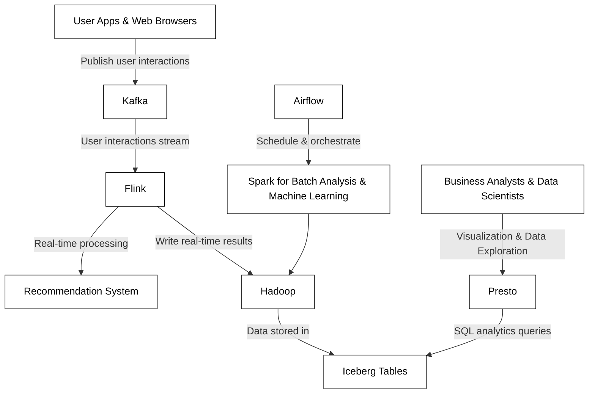

# How to Design the Image Recommendation Engine for Pinterest

# Intro

We're tasked with designing a scalable image recommendation system for Pinterest. It leverages the latest in big data and machine learning technologies, such as Kafka, Flink, Spark, Hadoop, Iceberg, Airflow, and Presto.

## Assumptions for the Technical Workflow:
- Pinterest's platform gathers millions of user interactions every day, including image views, saves, comments, and likes.
- The image recommendation engine must adapt quickly to a user's changing interests and provide real-time, personalized content.

## Overall Architecture Design

```python
User Apps & Web Browsers
     |
     | Publish user interactions (clicks, views, etc.)
     v
    Kafka
     |
     | User interactions stream
     |
     v
    Flink --------------> Perform real-time processing, update recommendation models
     |
     | Write Flink results
     v
    Hadoop <---> Iceberg  <------------- Airflow coordinating batch jobs
     |        | Tables                   |
     |        |                          |
     |<-- Batch Processing & ETL via Spark
     |
     | SQL queries for deep analytics
     v
   Presto
     |
     | Visualization & Data Exploration
     v
Business Analysts & Data Scientists
```



### Technical Workflow:

### 1. Data Ingestion (Apache Kafka):
- **Kafka Producers**: Embed in the Pinterest app and web client. They serialize user activities into compact JSON or Avro formats and send events to `user-interactions` topics, partitioned principally by user ID for efficient stream processing.
- **Kafka Brokers**: Set up with topic partitions for redundancy and parallelism, and to ensure high availability and durability of the user interaction events. The partitioning allows for horizontal scalability in the face of increasing data volumes.

### 2. Real-time Stream Processing (Apache Flink):
- **Streaming Jobs in Flink**: These jobs use Flink's rich CEP (Complex Event Processing) library to identify patterns of user interactions. They might capture sequences like frequent views of a particular image category, which triggers an immediate update to the user's real-time recommendation profile.
- **Real-time Recommendation Model Updates**: Take advantage of Flink's state management to quickly adjust recommendation models. These models are stored in state backends, with Flink ensuring fault tolerance using its snapshot and checkpoint mechanisms.

### 3. Batch Processing and Analysis (Apache Spark):
- **Feature Extraction and Machine Learning**: Utilize Spark MLlib to periodically train collaborative filtering, clustering, and deep learning models. These models consume significant amounts of image metadata, user demographic information, and historical interaction logs to improve recommendation accuracy.
- **Data Preprocessing and ETL Jobs**: Regularly extract, transform, and load fresh data from HDFS into the format required by machine learning models, performed by Spark's SQL and Dataframe/Dataset APIs.

### 4. Workflow Orchestration (Apache Airflow):
- **Machine Learning Pipeline Coordination**: Use Airflow to manage dependencies among batch jobs, which includes pre-processing data, re-training recommendation models, and updating the production model serving layer.
- **Data Pipeline Monitoring**: Allows for monitoring and scheduling of regular ETL jobs and ensures that model training occurs on an updated dataset.

### 5. Data Storage (Hadoop + Apache Iceberg):
- **Raw Data Storage in HDFS**: Acts as the central repository store for raw event data, user profiles, and image metadata. Optimized for sequential access patterns and leverages Hadoop's robust data replication for fault tolerance.
- **Curated Data Layers with Iceberg**: Iceberg tables store derived views, aggregated metrics, and machine learning features, optimizing the most common access patterns and providing ACID transactions to keep analytical data consistent even during updates.

### 6. Interactive Querying (Presto):
- **Ad-Hoc Queries and Analysis**: Presto allows data scientists to quickly explore datasets and run ad-hoc analytical queries which help in identifying new trends. They can perform joins across various Iceberg tables containing user interactions, image features, and models' output scores.

### 7. Data Lifecycle and Schema Management:
- **Data Retention Policies**: Implemented within Kafka and HDFS to manage and age data, ensuring storage costs are optimized without compromising the ability to retrain historical models.
- **Schema Evolution in Iceberg**: Provides flexibility in evolving metadata structures and data schema as the formats of user interactions and image representations change over time.

### 8. Advanced Machine Learning and Analytics (Spark + MLlib):
- **Model Training and Evaluation**: Utilizes large-scale, distributed processing capabilities of Spark to handle the computationally intensive task of machine learning model training, feature engineering, and historical data analysis.

### 9. Monitoring and Governance:
- **Comprehensive Monitoring**: Collects metrics and logs from Kafka, Flink, Spark, and Presto jobs using tools like Prometheus and ELK Stack. These metrics are vital for identifying processing bottlenecks and ensuring the reliability of the data pipelines.
- **Data Governance and Compliance**: Implemented across all data stores, with policies enforced to maintain data privacy, access controls, audit logging, and lineage tracking through tools like Apache Atlas and Ranger.

## Technical Detail Followups

### Kafka

- **Q:** 
    How does the Kafka architecture handle failures and ensure message durability?
    - **A:** 
        
        Kafka uses a distributed commit log, where messages are appended and replicated across multiple brokers. Durability is ensured through these replications; if one broker fails, the others can provide the data. Kafka also uses a write-ahead log to disk, so messages are not lost in case of a system crash. A combination of in-sync replicas and acknowledgments from producers upon writes further fortifies the reliability of the message delivery.

### Flink

- **Q:** 
    Can you expand on how Flink's state management supports the real-time image recommendation feature?
    - **A:** 
        
        Flink's state management allows for the retention of relevant context during processing. For example, it can keep track of the current state of a user's interaction pattern or a model's parameters. This state is consistently checkpointed and stored in a persistent storage like HDFS or Amazon S3, so if there's a failure, the application can resume from the latest successful checkpoint, minimizing data loss and computation.

### Spark

- **Q:** 
    How does Spark handle the iterative computation required for machine learning algorithms used in image recommendations?
    - **A:** 
        
        Spark's core abstraction, the Resilient Distributed Dataset (RDD), is well suited for iterative algorithms common in machine learning. This is because once an RDD is loaded into memory, it's kept there for as long as necessary, drastically speeding up iterative data passes essential for algorithms like gradient descent. Spark's MLlib also optimizes algorithms for distributed computing, partitioning the data across nodes to parallelize computations.

### Airflow

- **Q:** 
    How does Apache Airflow help managing dependencies in the ETL workflows for the recommendation engine?
    - **A:** 
        
        In Airflow, workflows are expressed as DAGs, with each node representing a task and the edges representing dependencies between these tasks. Airflow can manage scheduling and running these tasks based on the specified dependencies, and it supports complex workflows where the execution order of tasks is critical. It also retries failed tasks, sends alerts, and can dynamically adjust workflows based on parameters or external triggers.

### Hadoop & Iceberg

- **Q:** 
    Describe how Hadoop and Apache Iceberg work together to manage the large datasets in this application.
    - **A:** 
        
        Hadoop provides the distributed storage (HDFS) and computing resources (YARN) needed to manage and process large-scale datasets, while Apache Iceberg integrates with HDFS to manage these datasets as structured tables. Iceberg adds layers like snapshotting, schema evolution, and transactional capabilities on top of the raw file system, which allows for efficient updates and querying of massive tables within HDFS.

### Presto

- **Q:** 
    What specific features of Presto make it a fit for the interactive querying requirements of data scientists?
    - **A:** 
        
        Presto's in-memory distributed query engine is designed for low-latency, interactive data analysis. It supports complex SQL queries, including aggregations, joins, and window functions that are essential for data scientists to explore and analyze big data quickly. Its ability to query data where it lives, without the need for data movement or transformation, streamlines analysis and reduces time to insight.

### Data Lifecycle and Schema Management

- **Q:** 
    Can you delve into the specifics of how schema evolution is handled in a pipeline with mixed batch and real-time components?
    - **A:** 
        
        Schema evolution must be managed carefully to ensure compatibility across different data models used by batch and real-time systems. Iceberg helps manage this by allowing schema changes to occur without downtime or requiring a rewrite of data. It maintains a history of schemas and supports schema enforcement and evolution with backward and forward compatibility. Data produced by real-time Flink jobs can evolve, and batch-based Spark jobs can accommodate these changes, as both can interact with the updated schema without interrupt to ongoing operations.

### Advanced Machine Learning and Analytics

- **Q:** 
    Explain the process of feature engineering for images in Spark and how it contributes to recommendation quality.
    - **A:** 
        
        Feature engineering in Spark for images involves extracting meaningful information from raw image data that can be used to train recommendation models. Using Spark's MLlib, we could perform tasks like resizing images, normalizing pixel values, and extracting color histograms or texture patterns. MLlib can also be used to apply more sophisticated techniques like deep learning to extract higher-level features. These engineered features are critical for training effective recommendation models that can distinguish between different types of images and user preferences.

### Monitoring and Governance

- **Q:** 
    How does the monitoring infrastructure support the operational stability of the image recommendation service?
    - **A:** 
        
        The monitoring infrastructure collects metrics and logs from all components of the pipeline. With tools like Prometheus, we can track system performance metrics in real time and set up alerts to notify if certain thresholds are exceeded. The ELK Stack is used for log analysis, which helps in diagnosing system problems and understanding user behavior. Together, they ensure the operational stability of the service by allowing us to rapidly identify and address issues as they arise, ensuring a smooth user experience.

## Design Choice Follow ups

Here are more detailed Q&A examples focusing on the context of a real-world Pinterest-like image recommendation system, weighing the pros and cons of utilized technologies, and discussing alternatives:

### Kafka

- **Q:** 
    Why choose Kafka over other messaging systems for real-time user interaction data ingestion?
    - **A:** 
        
        Kafka is highly scalable and durable, making it ideal for handling the high-volume and high-velocity data streams produced by Pinterest's user interaction events. Its distributed nature and partitioned topics provide fault tolerance and low-latency, which are crucial for real-time recommendation systems.
    - **Cons:** 
        
        Kafka can be complex to set up and operate, particularly regarding cluster management and monitoring.
    - **Alternatives:** 
        
        Apache Pulsar is an alternative that can offer similar scalability and durability, with native support for multi-tenancy and geo-replication, which could be beneficial for a global platform like Pinterest.

### Flink

- **Q:** 
    What makes Flink the preferred choice for real-time recommendation updates and not other stream processing frameworks?
    - **A:** 
        
        Flink's ability to handle complex event processing and maintain rich state management is unmatched. This enables more sophisticated real-time recommendation model updates and user interaction pattern analysis.
    - **Cons:** 
        
        Flink's complex event processing capabilities might be overkill for simpler interaction patterns or where latency is less of a concern.
    - **Alternatives:** 
        
        Apache Storm is a simpler alternative for stream processing that can be considered if the processing needs are less complex. For tightly integrated Kafka environments, Kafka Streams might suffice for lightweight, real-time processing tasks.

### Spark

- **Q:** 
    In the context of feature extraction and machine learning for image recommendations, what are Spark's advantages and disadvantages?
    - **A:** 
        
        Spark's MLlib for machine learning and its overall ecosystem for big data processing makes it versatile for handling the ETL, feature extraction, and model training workloads. It is efficient at iterative computation, which is essential in training machine learning models.
    - **Cons:** 
        
        Spark's in-memory processing model can be expensive, especially when dealing with very large datasets, as it requires a large amount of RAM.
    - **Alternatives:** 
        
        Hadoop MapReduce can be a more cost-effective batch processing alternative in environments that are not latency-sensitive. For deep learning specific tasks, frameworks like TensorFlow or PyTorch could be integrated for GPU-accelerated processing.

### Airflow

- **Q:** 
    What features does Airflow offer over other workflow management tools?
    - **A:** 
        
        Airflow provides an expressive framework for defining complex dependencies and schedules in data processing pipelines. Its user-friendly UI and extensive monitoring capabilities make managing workflows much more straightforward.
    - **Cons:** 
        
        Airflow can be resource-intensive and has a steeper learning curve, particularly for those unfamiliar with Python.
    - **Alternatives:** 
        
        Luigi is a simpler Python-based workflow engine that might be appropriate for smaller-scale or less complex workflows. Apache NiFi offers a more GUI-driven approach for data flow management and could be preferable for teams looking for less code-intensive solutions.

### Hadoop & Iceberg

- **Q:** 
    Are there any drawbacks to using Hadoop and Iceberg, and what other systems could be used?
    - **A:** 
        
        Hadoop's HDFS is proven, reliable, and integrates well with big data processing tools. However, it might not be as cost-effective for storage compared to cloud object stores and is complex to manage. Iceberg provides excellent table management features, but is relatively new and has less community support compared to more mature tools.
    - **Cons:** 
        
        Hadoop cluster requires significant setup and maintenance efforts. Iceberg is not as battle-tested as other formats and may still be evolving.
    - **Alternatives:** 
        
        Cloud-based storage options like Amazon S3 or Azure Data Lake Storage offer similar scalability with lower operational overhead. Delta Lake is an alternative to Iceberg that provides similar ACID guarantees and seamless integration with Databricks’ platform.

### Presto

- **Q:** 
    Presto is used for interactive querying, but what factors should we consider when choosing it, and are there any competitive technologies?
    - **A:** 
        
        Presto's distributed architecture allows for fast query execution over large datasets, which is critical for data exploration and timely insights. However, for very large-scale data warehousing tasks and complex query workloads, Presto may not perform as well as dedicated solutions.
    - **Cons:** 
        
        Presto may not handle long-running analytical queries as effectively due to its design for ad-hoc querying. Also, it could be less cost-effective for persistent workloads.
    - **Alternatives:** 
        
        Apache Drill supports similar SQL queries on large-scale data but can be more forgiving on resource demands. Amazon Athena and Google BigQuery offer serverless querying options for those already invested in the respective cloud ecosystems.