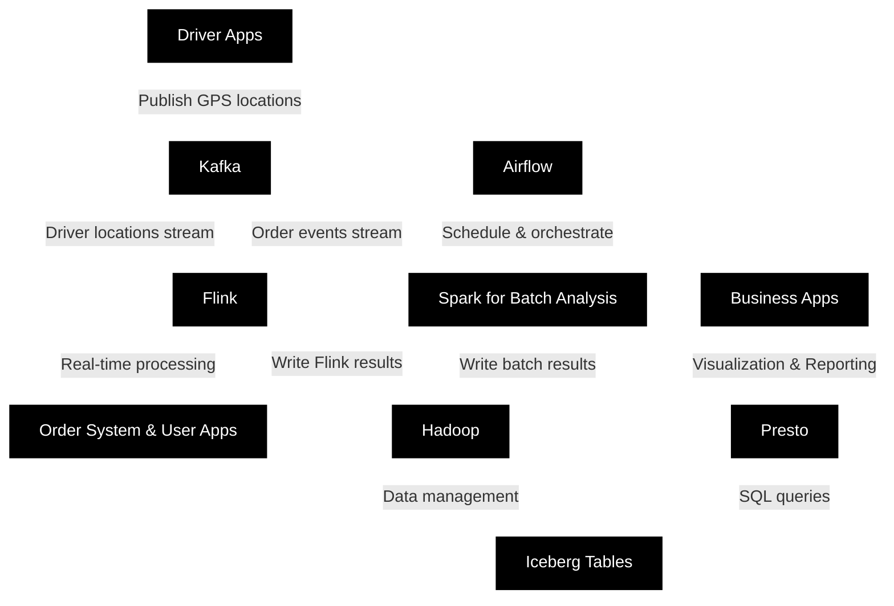

# How to Design the Data Infra for Uber Eats Order Tracking Page

# Intro

A real world example to build scalable data analytics with tools like Kafka, Flink, Spark, Presto, Airflow, Iceberg, etc. Let's delve into a more technical scenario that incorporates Kafka, Flink, Spark, Hadoop, Iceberg, Airflow, and Presto into a comprehensive real-time data processing and analytics pipeline:

## Assumptions for the Technical Workflow:

- An Uber Eats-like app tracks the location of drivers and communicates order details to users.
- The system must handle real-time processing, such as matching drivers with orders, and longer-term analytical processing, like optimizing driver routes and forecasting delivery times.

## Overall Architecture Design

### Simple Architecture Diagram

#### Ascii Style
```python
Driver Apps
     |
     | Publish GPS locations
     v
    Kafka
     |\
     | | Driver locations stream
     | |
     | v
     | Flink ----------> Compute aggregations
     | |               | Join streams
     | | Order events  | Manage stateful processing
     | | Stream        |
     v |               |
Order System & User Apps
     |               |
     | Write Flink results
     v               |
    Hadoop <--------/   <-------------- Airflow orchestrating tasks
     |   ^                            |
     |   | Data written back by Spark |
     |   | and other batch jobs       |
     v   |                            |
 Iceberg Tables <---------------------+
     |
     | SQL queries for analytics
     v
   Presto
     |
     | Visualization & Reporting
     v
Business Apps
```

#### Mermaid Style


### Technical Workflow:

### 1. Data Ingestion (Apache Kafka):

- **Kafka Producers**: The driver app constantly publishes GPS coordinates to a Kafka topic `driver-locations`, using a producer client library. Each message might be keyed by driver ID to ensure location updates for a given driver go to the same partition for order.
- **Kafka Consumers**: Other systems subscribe to the `driver-locations` topic to receive updates. Additionally, consumer applications are set up for topics like `order-events` that handle order placement, acceptance, and completions.
- Kafka topics are partitioned and replicated to ensure scalability and fault tolerance.

### 2. Real-time Stream Processing (Apache Flink):

- **Flink Jobs**: Flink jobs are configured to subscribe to `driver-locations` and `order-events`. They perform tasks such as:
    - Windowed aggregations to compute the latest location of each driver.
    - Join operations between driver locations and pending orders to facilitate real-time matching and dispatching.
    - Stateful processing for ETA calculations and sending notifications to customers via external systems when a driver is nearby.

### 3. Batch Processing and Analysis (Apache Spark):

- **Spark Jobs**: Scheduled batch Spark jobs are written in Scala or Python and deal with complex analytical tasks, including:
    - Training machine learning models on historical delivery data to predict delivery times (using MLlib).
    - Aggregating delivery data nightly to create performance metrics per driver or per region.

### 4. Workflow Orchestration (Apache Airflow):

- **Airflow DAGs (Directed Acyclic Graphs)**: Define the dependent jobs and workflows that orchestrate processing tasks. An Airflow DAG might include:
    - A task to run a Spark job that rebuilds machine learning models.
    - Another task to batch-process the day's data and update Iceberg tables.
    - Scheduling and triggering Flink jobs for real-time streaming when needed.

### 5. Data Storage (Hadoop + Apache Iceberg):

- **HDFS**: Raw data from Kafka is landed into HDFS, and processed data is stored there for long-term historical analysis.
- **Iceberg Tables**: Transactional data tables managed by Iceberg provide consistent snapshots of large-scale datasets and support schema evolution for the raw Kafka data and the results of Spark jobs.

### 6. Interactive Querying (Presto):

- **Presto SQL Queries**: Analysts use Presto to perform SQL queries on stored Hadoop data and Iceberg tables to gain insights or create real-time dashboards. Example queries might include:
    - SQL to join today's real-time data with historical trends.
    - Aggregation queries to analyze delivery efficiency across different areas.

### 7. Data Lifecycle and Schema Management:

- Iceberg table partitioning is configured for efficient data retrieval, e.g., by time window or geographical region.
- Data retention policies are configured in Kafka to govern how long data is kept, considering storage costs and compliance requirements.
- Iceberg's schema evolution allows for seamless transitions when altering data structures or incorporating new data sources.

### 8. Advanced Machine Learning and Analytics (Spark + MLlib):

- Historical data in Iceberg tables is used to train and refine predictive models for delivery ETA, taking advantage of features like lookback windows and seasonal trends.
- Airflow DAGs keep model training and evaluations consistent, reproducible, and on schedule.

### 9. Monitoring and Governance:

- Comprehensive logging is set up for all components, including Kafka brokers, Flink job managers, and Spark driver/executor processes.
- A monitoring solution (such as Prometheus with Grafana) watches over the health and performance of the infrastructure, ensuring SLAs are met.
- Data governance is enforced via policies and access controls for sensitive data in HDFS and Iceberg, audited by tools such as Apache Ranger.

The synergy in such a technical workflow allows an Uber Eats-like service to leverage strengths from each tool — Kafka for ingestion, Flink for real-time processing, Spark for batch processing and ML, Airflow for orchestration, Iceberg for managing large-scale data tables, and Presto for interactive querying. This enables real-time communication to users and drivers while also providing a platform for advanced analytics and strategic decision-making based on historical and current data.

## Technical Detail Followups

### Kafka

- **Q:** How do you ensure data consistency in your Kafka cluster?

  - **A:** Kafka ensures data consistency by replicable partitions, where each partition has one leader and multiple in-sync replicas (ISRs). The leader handles all the read and write requests for that partition, and ISRs replicate the leader's data. Consumers typically read from the leader to ensure they receive the most up-to-date records.

- **Q:** Can you explain the role of Zookeeper in a Kafka ecosystem?

  - **A:** Zookeeper plays a critical role in Kafka's architecture; it manages and coordinates Kafka brokers. It's responsible for leader election for partitions, managing configuration information, and maintaining a list of Kafka brokers and topics, as well as their status.


### Flink

- **Q:** What advantages does Flink provide when dealing with stateful computations?

  - **A:** Flink offers robust state management and fault tolerance for stateful computations in streaming data. It maintains a consistent snapshot of all state throughout an application’s execution, which can be recovered in case of a failure. Flink's checkpointing and savepoints feature are key for ensuring exactly-once processing semantics.

- **Q:** How does Flink handle event time and out-of-order events?

  - **A:** Flink features an event time concept that deals with the time at which events actually occurred, as opposed to when they are processed by the system. With watermarks, which are special types of events that specify the progress of event time, Flink is capable of handling out-of-order events or late-arriving data.

### Spark

- **Q:** What is the difference between RDDs, DataFrames, and Datasets in Spark?

  - **A:** RDD (Resilient Distributed Dataset) is the fundamental data structure in Spark - an immutable distributed collection of objects that can be processed in parallel. DataFrames are a collection of RDDs, but with a schema, which provides a higher level abstraction and optimization opportunities through Catalyst optimizer. Datasets are a type-safe version of DataFrames, allowing users to work with strongly-typed data collected as JVM objects.

- **Q:** How does Spark achieve fault tolerance?

  - **A:** Spark achieves fault tolerance through its immutable data structure and lineage graph. In case of a partition failure, Spark can recompute the lost partition by replaying the transformations used to build the lineage of the RDD. This significantly reduces the need for data replication for fault tolerance purposes.

### Hadoop

- **Q:** What are some of the core components of a Hadoop ecosystem?

  - **A:** The core of Hadoop consists of the storage layer, HDFS (Hadoop Distributed File System), for reliable storage of massive datasets, and YARN (Yet Another Resource Negotiator), for cluster resource management, and the MapReduce programming model for processing large datasets in parallel.

- **Q:** How is data stored and processed in Hadoop?

  - **A:** In Hadoop, data is stored in HDFS across a distributed file system that spans the nodes in a Hadoop cluster. Data is processed using a MapReduce job where the data is first mapped, sorted/shuffled, and then reduced to produce an output - each of these steps can run in parallel across the cluster's nodes.


### Iceberg

- **Q:** What is Apache Iceberg and how does it help with managing large data sets?

  - **A:** Apache Iceberg is a table format for large data sets that enables high-performance queries in distributed computing environments. It adds more structure and optimization to data storage, providing benefits like snapshot isolation, schema evolution, and efficient querying through hidden partitioning.

- **Q:** Can Iceberg tables work with both batch and streaming data?

  - **A:** Yes, Iceberg tables are designed to support both batch and stream processing workloads seamlessly. They can be read and written to using traditional batch operations or incrementally using streaming workloads, thus, providing flexibility and ensuring up-to-date views of data.

### Airflow

- **Q:** What are the benefits of using Apache Airflow for workflow orchestration?

  - **A:** Apache Airflow provides a highly customizable platform for scheduling and coordinating complex data pipelines. It enables developers to define workflows as code, which allows for easy versioning, testing, and reusability. Its rich user interface aids in visualizing workflows, monitoring job progress, and diagnosing issues.

- **Q:** How do you ensure that a task in Airflow is idempotent?

  - **A:** To make sure that a task in Airflow is idempotent - producing the same result regardless of how many times it’s executed - you'd structure your tasks so that the output depends solely on the inputs and the code at execution time. Also, using Airflow's extensive logging and external systems for state management can help ensure idempotency.

### Presto

- **Q:** Why would you use Presto over other SQL-on-Hadoop engines?

  - **A:** Presto is designed for low-latency queries and is generally faster than other SQL-on-Hadoop engines due to its distributed architecture and query execution strategies. Unlike others, Presto does not use MapReduce; it processes data using an in-memory pipeline execution model which is significantly faster.

- **Q:** How does Presto interact with different data sources, such as Iceberg or Kafka?

  - **A:** Presto has a connector architecture that allows it to interact with various data sources. For Iceberg, the Presto Iceberg connector provides support for reading from and writing to Iceberg tables. For Kafka, the Presto Kafka connector allows Presto to query Kafka topics directly as if they were tables. This flexibility makes it easy to combine and query data across different storage systems.

## Design Choice Follow ups

### Kafka

- **Q:** Why Kafka for tracking driver locations in real time and not other systems like RabbitMQ or ActiveMQ?

  - **A:** Kafka is built for high throughput and is capable of handling the vast volume of location updates generated by drivers—potentially millions of messages per second. Unlike RabbitMQ or ActiveMQ, Kafka excels at handling large streams of data efficiently, making it ideal for real-time analytics use cases. Also, Kafka's durable storage model allows us to reprocess historical data if needed.


  - **Pros:**
    - High throughput and scalability.
    - Built-in partitioning and replication.
    - Fault tolerance.

  - **Cons:**
    - Complexity in setup and management.
    - Broker-centric storage with less queuing flexibility.

  - **Alternatives:**
    - RabbitMQ or Pulsar for simpler setups or additional messaging features but with potential scalability limitations.

### Flink

- **Q:** Why use Apache Flink for real-time processing of driver locations?

  - **A:** Flink provides low-latency, accurate stream processing, which is critical for the driver location updates to reach customers in a timely manner. It's also good at handling stateful computations, like aggregating driver locations over windows of time. Apache Flink was chosen over alternatives like Apache Storm due to its greater throughput and ease of state management. However, we also considered Apache Kafka Streams for its tight integration with Kafka, but Flink offered more advanced windowing and state management features.

  - **Pros:**
    - High performance and low latency.
    - Advanced state management.
    - Effective event-time handling.

  - **Cons:**
    - Complexity for simpler stream processing needs.
    - Possible overkill for less demanding tasks.

  - **Alternatives:**
    - Apache Storm for competent stream processing or Kafka Streams for Kafka-centric applications.

### Spark

- **Q:** Why is Apache Spark preferred for batch processing and ML over other frameworks?

  - **A:** Spark provides a robust MLlib for machine learning, which we use to predict delivery times. It's optimized for iterative algorithms, such as those used in machine learning, and its in-memory computing capabilities speed up processing. This makes it highly effective for our driver location data analysis. An alternative could be Hadoop MapReduce, but it's a lot slower and less suited for complex analytics and ML tasks that Spark excels at.

  - **Pros:**
    - Fast performance with in-memory computing.
    - Comprehensive MLlib for machine learning tasks.
    - Unified APIs for diverse workloads.

  - **Cons:**
    - Resource-intensive, especially for memory.

  - **Alternatives:**
    - Hadoop MapReduce for cost-effective batch processing or cloud solutions like AWS EMR for managed services.

### Hadoop (HDFS)

- **Q:** Why prefer HDFS over cloud object storage like Amazon S3?

  - **A:** HDFS offers high throughput and is well-suited for the big data ecosystem, particularly with other Hadoop components. It integrates seamlessly with our data processing engines like Spark and our metadata management through Iceberg. While cloud object storage solutions are great for scalability and cost-effectiveness, HDFS gives us more control over our data locality and performance, which is important for our time-sensitive analytical workloads.


  - **Pros:**
    - Smooth integration with Hadoop-based tools.
    - High throughput and performance.

  - **Cons:**
    - Complexity in management and operations.
    - Less elasticity than cloud storage.

  - **Alternatives:**
    - Cloud solutions like Amazon S3 for scalability and simple operation.

### Iceberg

- **Q:** How does Apache Iceberg improve large data table management and what are other options?

  - **A:** Iceberg offers reliable, scalable management of big data tables, addressing issues with older file formats like concurrency, versioning, and schema evolution. Iceberg integrates well with Spark and Flink, allowing us to easily manage table formats on HDFS. One alternative is Apache Hive, but it has limitations with metadata scaling which Iceberg has been designed to overcome.

  - **Pros:**
    - Efficient metadata management.
    - Seamless schema evolution.
    - Performance optimization through hidden partitioning.

  - **Cons:**
    - Less mature compared to formats like Parquet.

  - **Alternatives:**
    - Apache Hive for a traditional data warehouse approach, or Delta Lake for ACID transactions and building data pipelines.

### Airflow

- **Q:** Why Airflow over other workflow tools?

  - **A:** Airflow excels at defining, scheduling, and monitoring complex data pipelines. Its ability to code workflows as Directed Acyclic Graphs (DAGs) offers flexibility and transparency we need. Moreover, Airflow's user interface and community support are excellent. As an alternative, we considered Luigi and Apache NiFi, but Airflow's abilities to integrate with our data stack and intuitive UI made it the ideal choice for us.
  - **Pros:**
    - Flexibility with a Python-based programming model.
    - Rich UI for management and monitoring.
    - Broad integration with data processing tools.

  - **Cons:**
    - Potential resource intensity for simple needs.
    - Learning curve for non-Python familiar developers.

  - **Alternatives:**
    - Luigi for simpler Python-centric workflows or Apache NiFi for a more visual-centric approach.

### Presto

- **Q:** Why Presto for interactive querying against other technologies?

  - **A:**  Presto's distributed in-memory architecture enables us to perform high-speed, ad-hoc queries directly on our data lake without data movement. It's flexible and supports a wide range of data sources, maintaining high performance for interactive analytics. We considered Apache Drill, but Presto's SQL compatibility and performance made it the better fit for our diverse data requirements.

  - **Pros:**
    - Fast querying over various data sources.
    - Strong SQL support for diverse BI tools.

  - **Cons:**
    - Costly for large datasets due to in-memory processing.
    - Suboptimal for extended, complex queries.

  - **Alternatives:**
    - Apache Drill for similar querying capabilities or managed cloud services like Amazon Athena for less operational involvement.