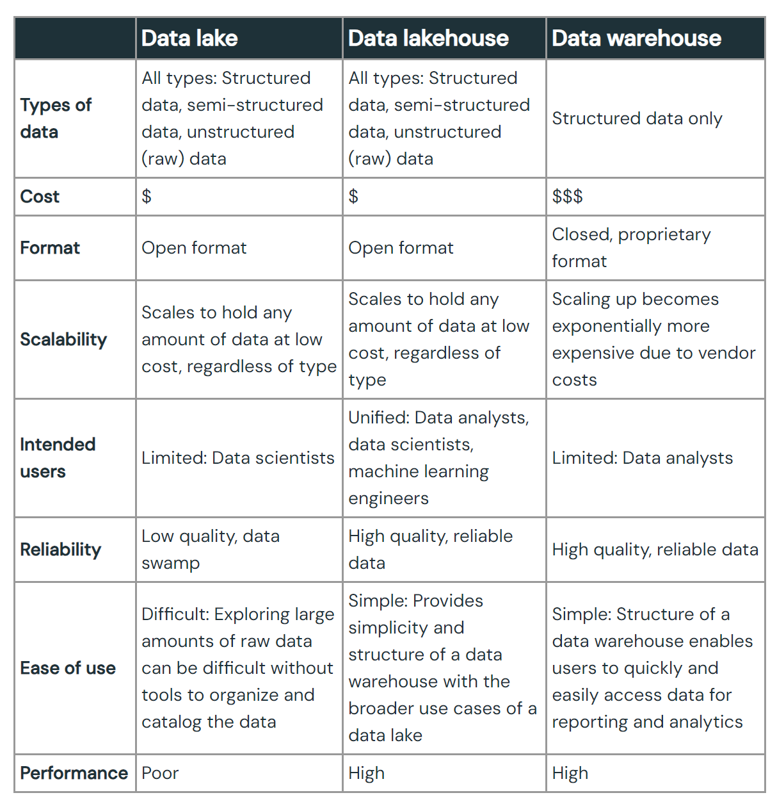
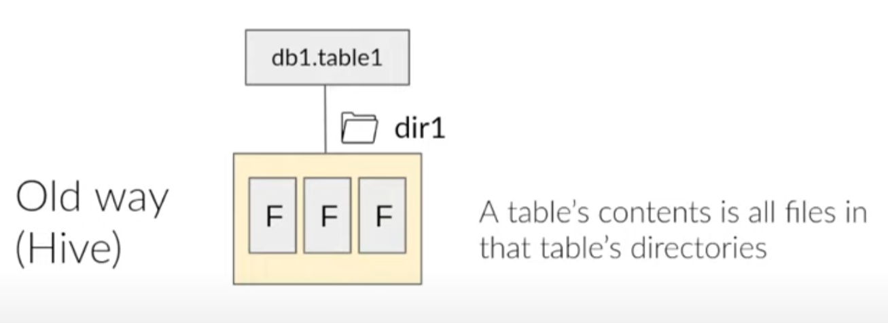
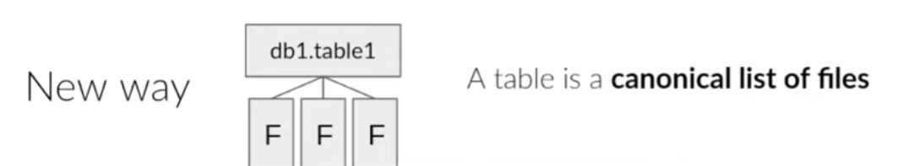
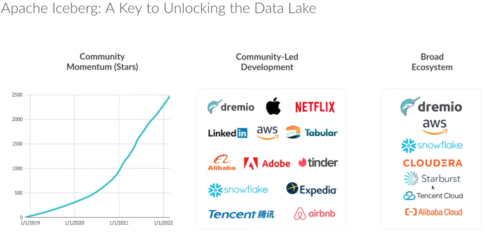

# The Problem & Solution Behind Iceberg's Origin

<aside>
💡 — What’s the problem and Why Iceberg?

</aside>

## What is a data lake?

- A data lake is a central location that holds a large amount of data in its native, raw format.
- Compared to a hierarchical data warehouse, which stores data in files or folders, a data lake uses a flat architecture and object storage to store the data.‍
- Object storage stores data with metadata tags and a unique identifier, which makes it easier to locate and retrieve data across regions, and improves performance.
- By leveraging inexpensive object storage and open formats, data lakes enable many applications to take advantage of the data.

## What’s a table format?

- A way to organize a datalake’s files to present them as a single table
- A way to answer the question — what data is in this table
- So user can query a bunch of files in a data lake (a bunch of files) just like a database or data warehouse
    - Extension on datalake
        - [https://www.databricks.com/discover/data-lakes](https://www.databricks.com/discover/data-lakes)

## The old de-facto standard — Hive

### Origin of Hive

- Originated from Facebook.
- In early days of datalakes, engineers have to write map reduce java code to interact with their Hadoop cluster.
- Hive is create to make life easier for people, instead of having to write java code, Hive translate the SQL into MapReduce scripts.
- To do that, we need a way to recognize files as tables.
- The approach Hive took is a directory-based approach. Where it would just treat a folder on a Hadoop cluster as a table. And subfolders will be partitions.

### Pros of Hive

- More efficient access patterns than full-table scans for every query (Better latency & Cost)
- Works with basically every engine since it’s been the de-facto standard for so long.
- File format agnostic
- Atomically update a whole partition (ACID guanrantee)
- Single, central answer to “what data is in this table” for the whole datalake ecosystem

### Cons of Hive

- Smaller updates are very inefficient
- No way to change data in multiple partitions safely
- In practice, Unsafe concurrent partition modifications
- All of the directory listings needed for large tables take a long time.
    - Extra effort needed to speed up a query: indexing, more processing power, materializing
- Users have to know the physical Layout of the table to take advantage of performance benefits of partitioning
- Hive table statics are often stale, and updating statics(with Analyze) is very slow

## How to resolve the issues with Hive?

Netflix having issues with Hive and in need of a new table format.

### Netflix’s Goals

- Table correctness/consistency
- Faster query planning and execution
- Allow users to not worry about the physical layout of the table
- Table evolution support. (Flexible schema, partitioning changes)
- Achieve all above at scale.

### The answer — Iceberg and what is it

### What is Iceberg? ✅

- Table format specification
- A set of APIs and libraries for interaction with that specification
    - These libraries are leveraged in other engines and tools that allow them to interact with  Iceberg tables

### What Iceberg is not? ❌

- Not a storage engine
- Not an execution engine
- Not a service

### Design Benefits of Iceberg

- Efficiently make smaller updates
    - Making changes at the file level instead of directory level
- Snapshot Isolation for transactions
    - Reads and writes don’t interfere with each other and all writes are atomic
        - Anytime the table changes, a snapshot is created.
        - Any read will be on the same latest snapshot
        - Any write will result in a sequence of write
    - Concurrent writes
- Faster planning and execution (Fresh metadata and statistics)
    - List of files defined on the write-side
    - Column stats in manifest files on the write-side
- Reliable metrics for CBOs
    - Done on write instead of “infrequent” expensive read job (Analyze)
- Abstract the physical, expose a logical view
    - Hidden partitioning, ppl don’t need to care how the files are stored physically, they just need to know the logical layout as it’s stored in the manifest (list of files and organization of these files)
    - Enables Compaction
        - built-in tools to optimize small files comes from streaming → better performance
    - Tables can change over time (schema and partitions)
    - Can rollback snapshots
- Rich schema evolution support
- All engines see changes immediately and can work together
- Community
    
    
    

## Reference:

- [Apache Iceberg Tutorial: Learn the Problem & Solution Behind Iceberg's Origin Story](https://www.youtube.com/watch?v=cI9zu5Rk_bQ)
- [Databrick's take on datalakes](https://www.databricks.com/discover/data-lakes)
- [Databrick's take on materialized views](https://www.databricks.com/glossary/materialized-views)