# 立直麻将 牌效率学习 (门清一般型)

[(大概)很好懂的牌效率](https://www.youtube.com/playlist?list=PLAOMOhCKGh68V0R4NGHL5u0WKkd9BL-PM)

## Chapter 1 数牌: 顺子和搭子

- Basics
    - 面子 = 顺子+刻子
- 顺子 >> 刻字
    - 顺子牌效率搭子 → 可以变成顺子的牌
        - 两面 >> 崁张 >> 边张
        - 数字强度
            - 34567 > 28 > 19
                
                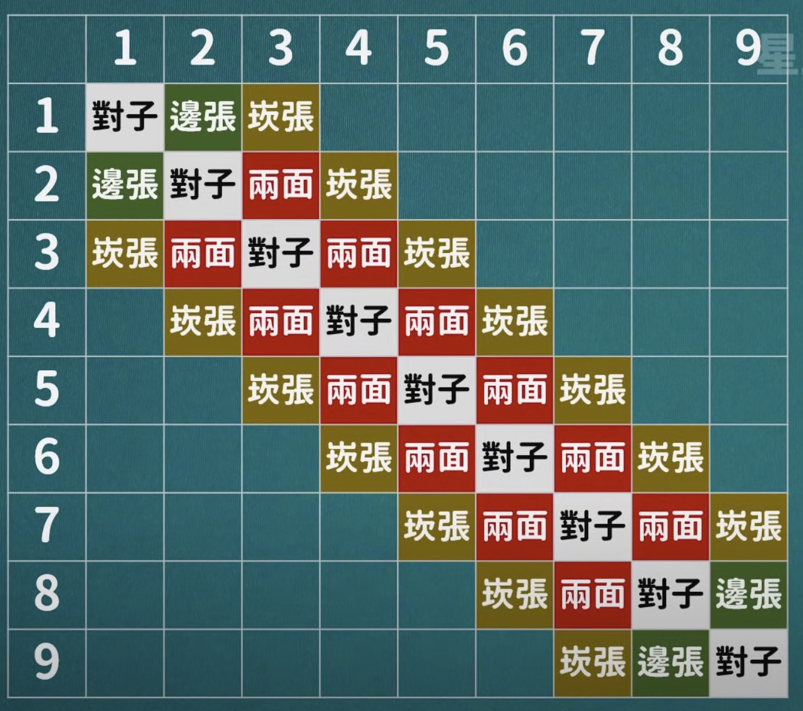
                

## Chapter 2 字牌 序盘处理

- 字牌组成面子的能力弱于数牌
- 字牌出现的数量越多, 价值急剧下降
- 单张字牌的价值
    - 比如 `1,4` `6,9` 这样的组合, 属于有效牌重复, 价值甚至低于客风牌
    - 役牌的价值一般高于19牌, 如果需要役则价值更高
        
        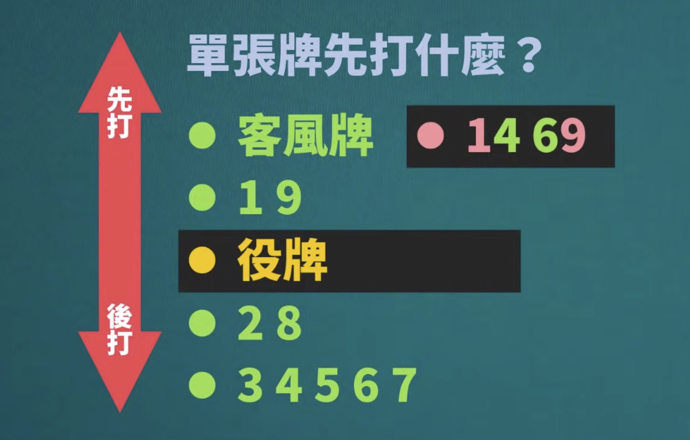
        

## Chapter 3 对子

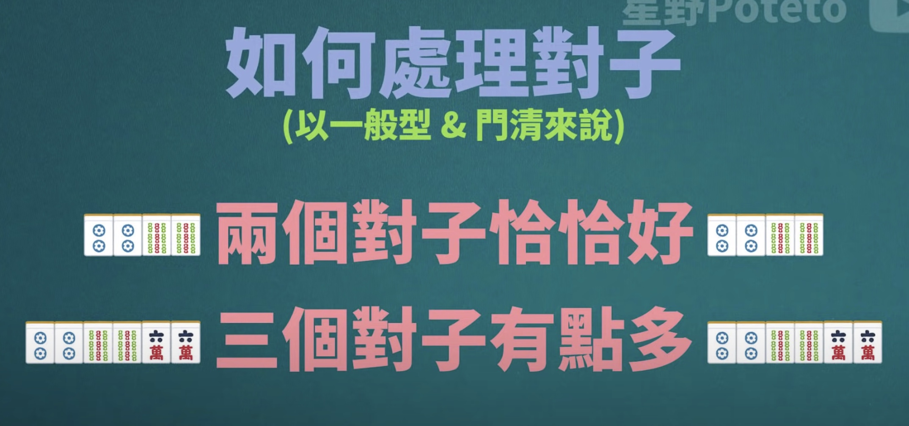

## Chapter 4 向听数, 有效牌, 五种听牌型

- 向听数
    
    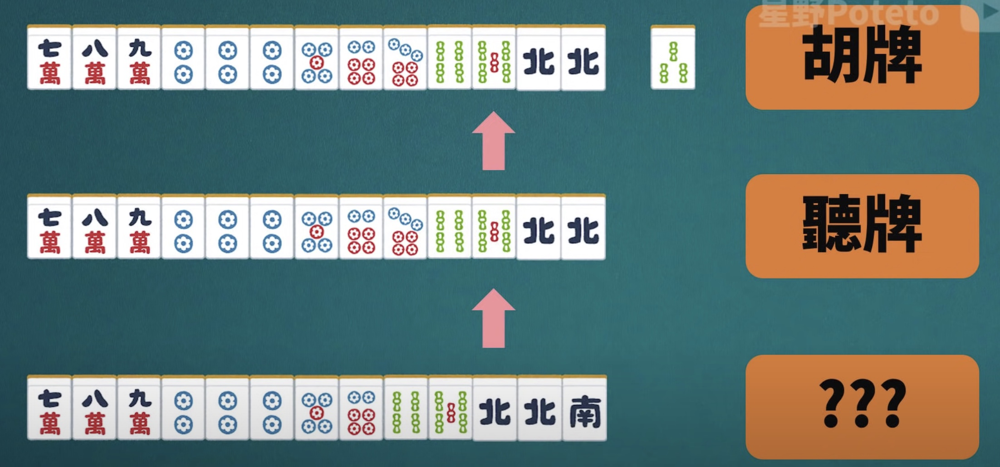
    
    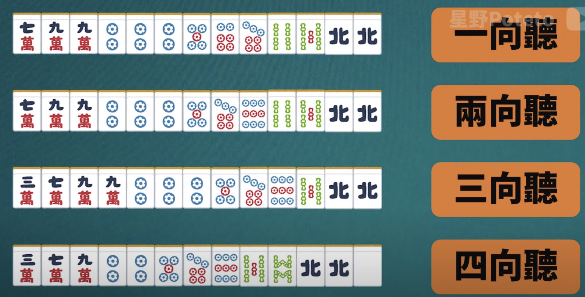
    
    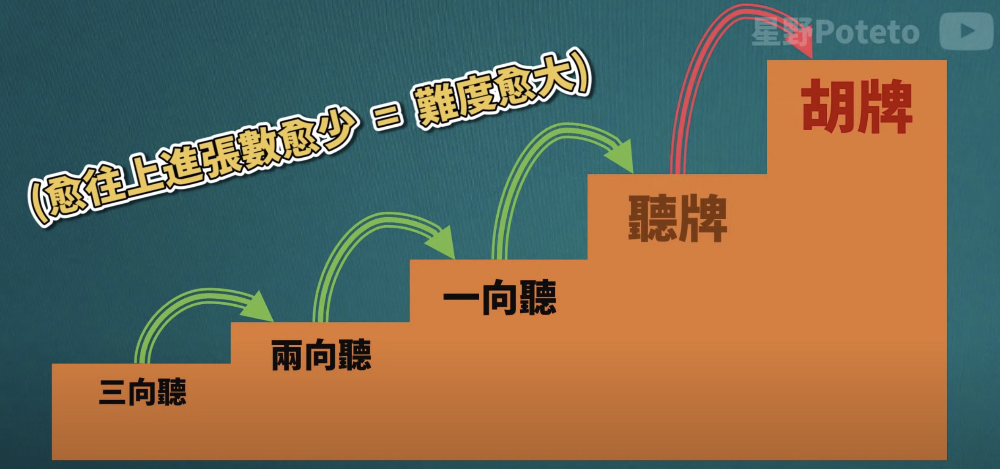
    
- 进张 → 可以使进入下一个向听阶段的牌
- 改良 → 使进张牌数增加
- 有效牌 = 进张+改良
- 听牌型
    - 两面听 → 8张
    - 双碰(两对) / 崁张 / 边张 → 4张
    - 单骑 → 3张, 但是转张自由度很高
- 复合听牌型
    - 双复合
        - 双单骑
            
            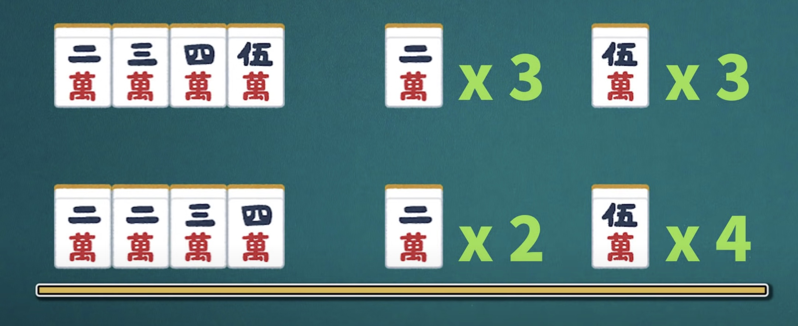
            
        - 螺丝型
            
            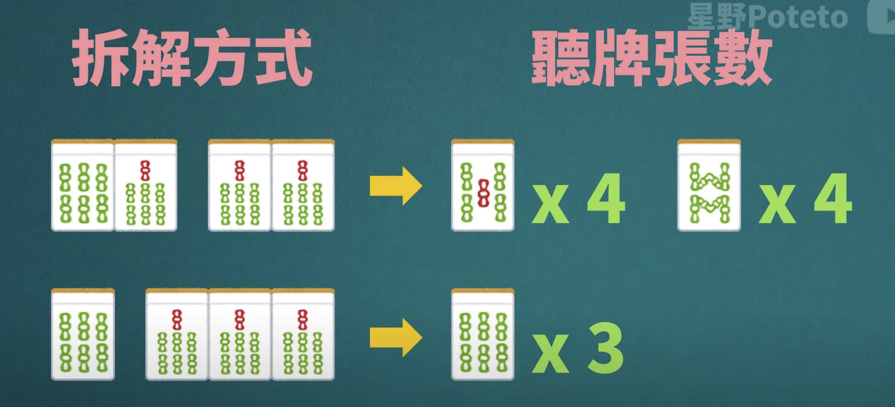
            
        - 顺子附近的数牌都可以让我们转更好的听牌型
            
            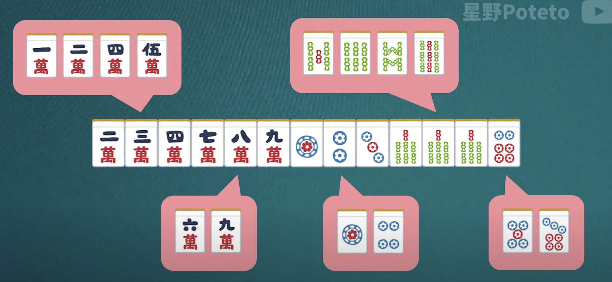
            
    - 复合三面听 (暗刻复合型就很舒服
        
        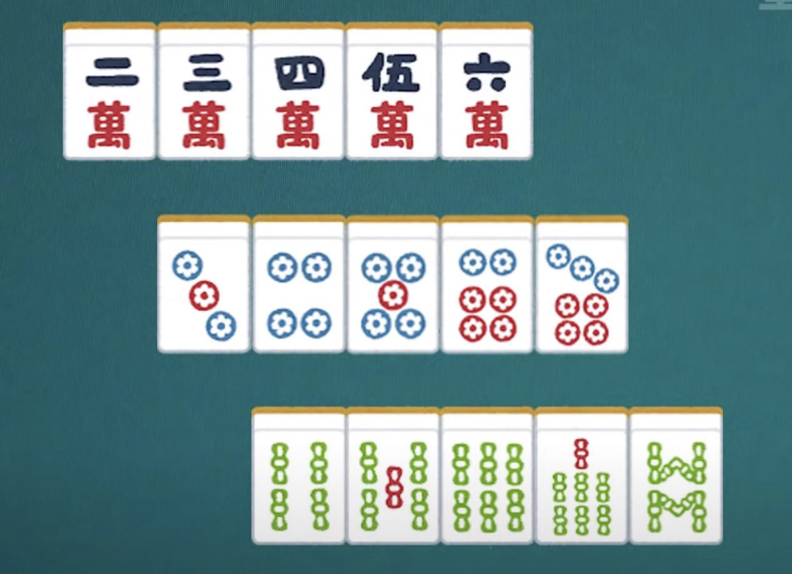
        
        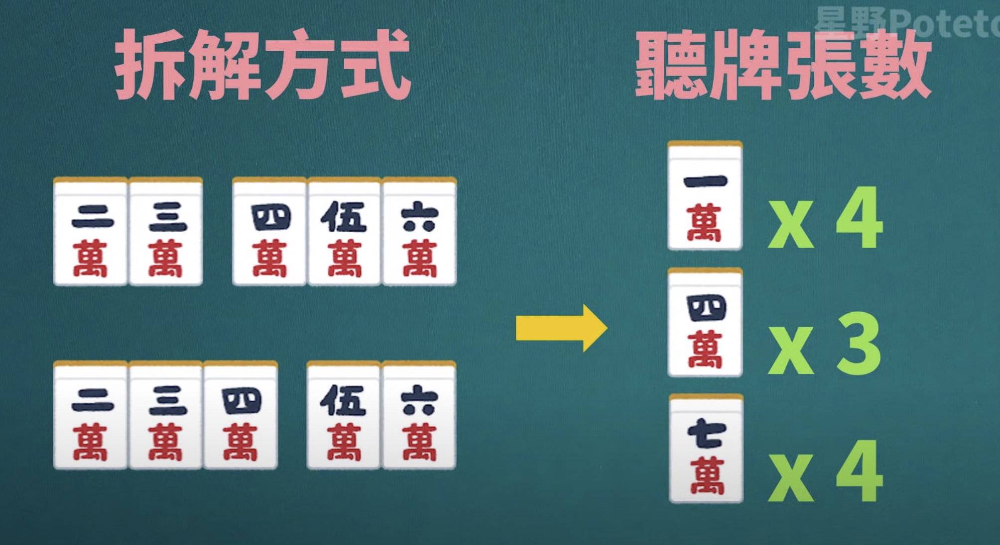
        
        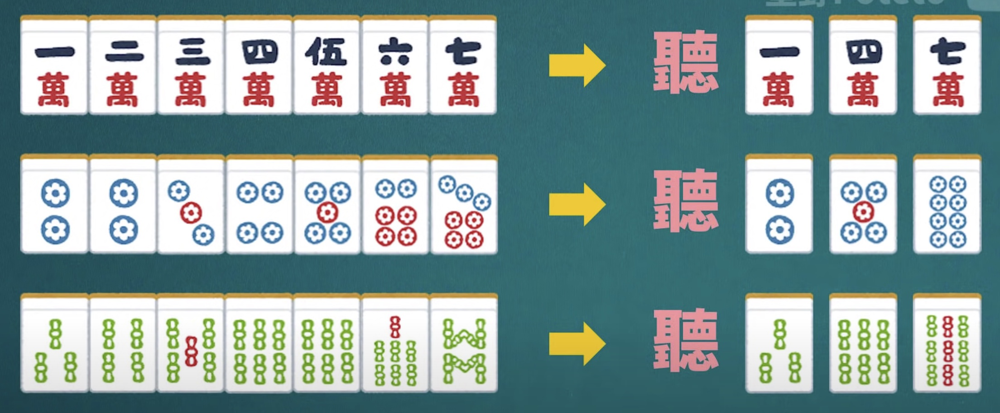
        
        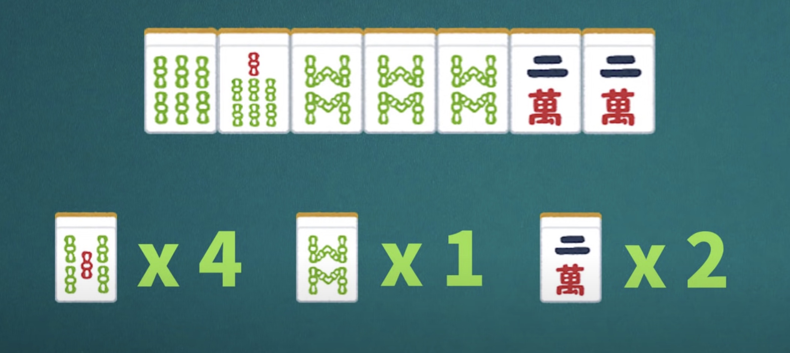
        
- 总结
    
    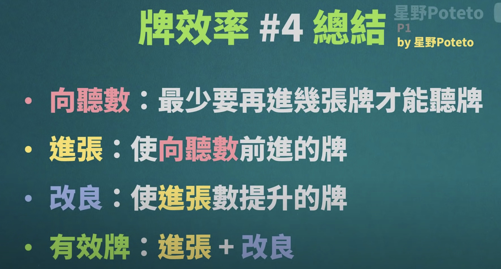
    
    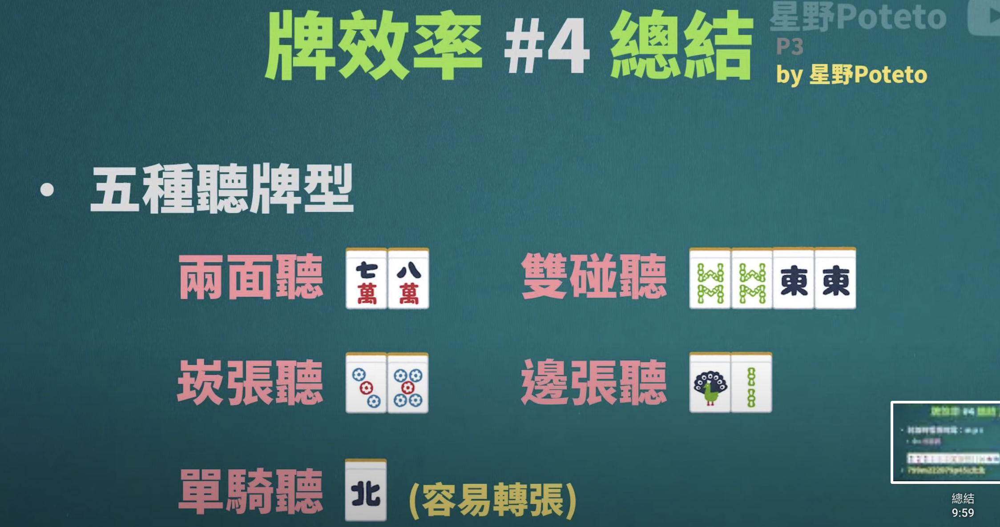
    
    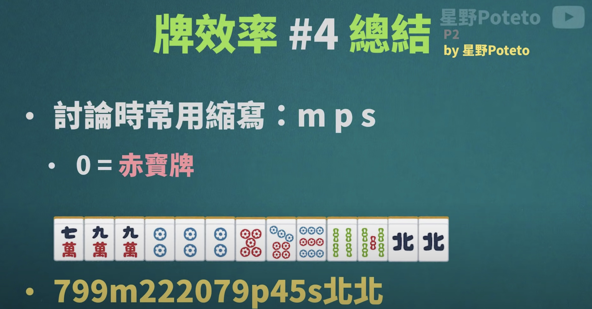
    
    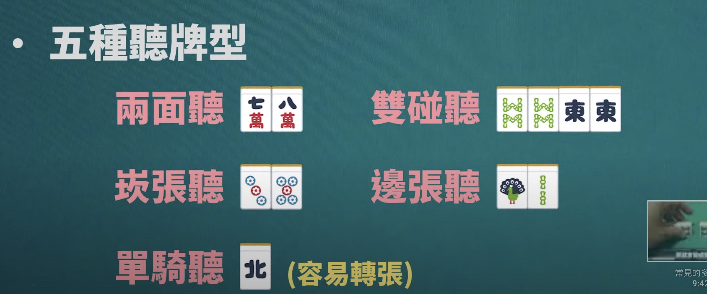
    
    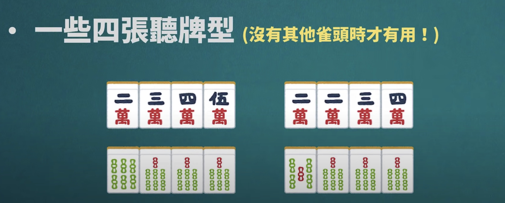
    
    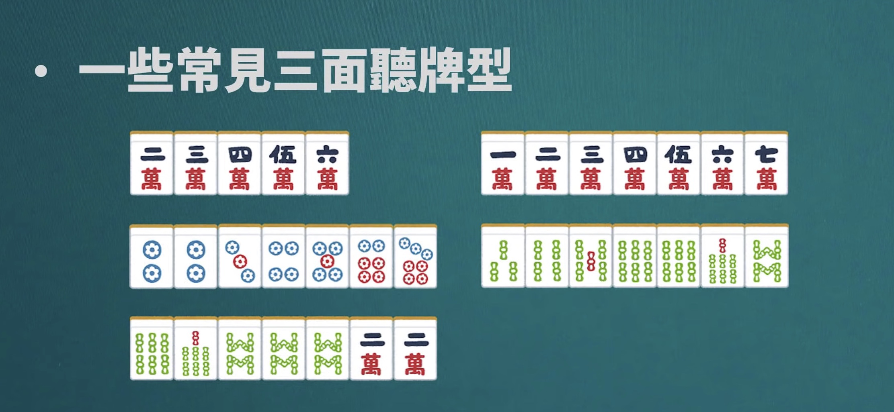
    

## Chapter 5 对子复合听牌, 补强牌